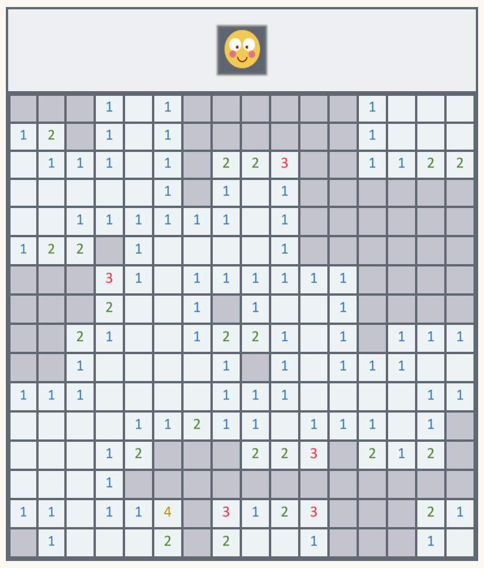

# 지뢰찾기 토이프로젝트

{: height="400px" width="400px"}

[게임 하러 가보기!](https://charles098.github.io/Toy-Project--Minesweeper/easy.html){:target="_blank"}      

## 1. 기능
1) 좌클릭(웃는 얼굴)   
 - 재시작   
2) 좌클릭(빈칸)   
 - 지뢰면 게임끝   
 - 지뢰 아니면 영역 점령
3) 좌클릭(점령한 영역)  
 - 근방에 지뢰가 없으면 영역 점령   
4) 우클릭
 - 빈칸이면 깃발 세팅
 - 깃발이면 빈칸으로 세팅

 ## 2. 난이도
 - 초급 : 9 x 9  지뢰 10개   
 - 중급 : 16x16  지뢰 40개   
 - 고급 : 30x16  지뢰 99개    
